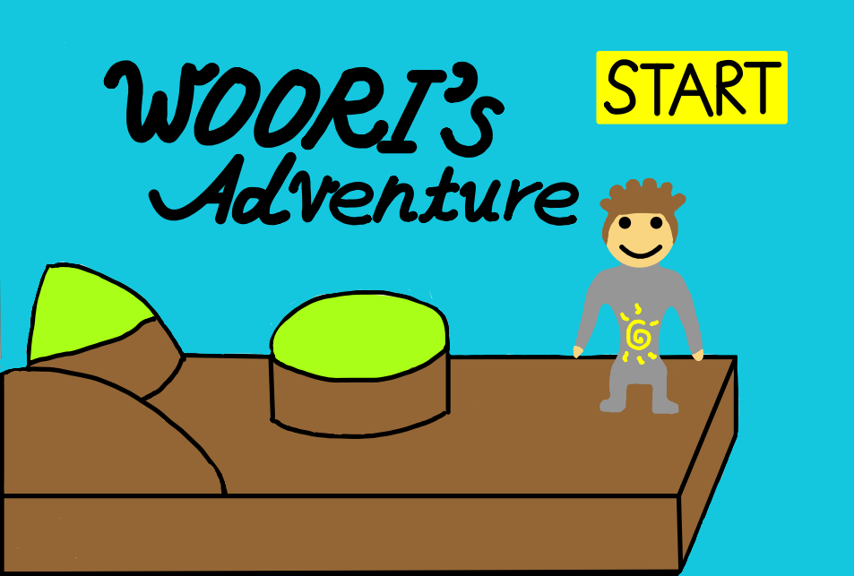
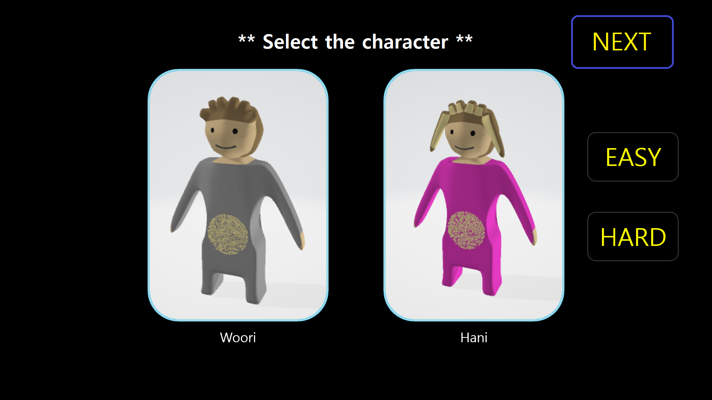

# Computer Graphics Team Project - Woori's Adventure
The goal of this team project is implementing a game that uses OpenGL for main graphics API.

## How to Play?
    $git clone https://github.com/hanwoolsky/CG_Team_Project.git
    
    Go to Team_Project/bin and execute cgmodel.exe

## Title image

## How to Play?

Choose your character and difficulty level

Move: direction key
Attack: space bar
Help: F1 key

## Contributer
1. hanwoolsky (Hanwool Huh)
2. SungSubKim (SeongSeob Kim)
3. Onebellfortune (JongUn Han)

## CopyRight